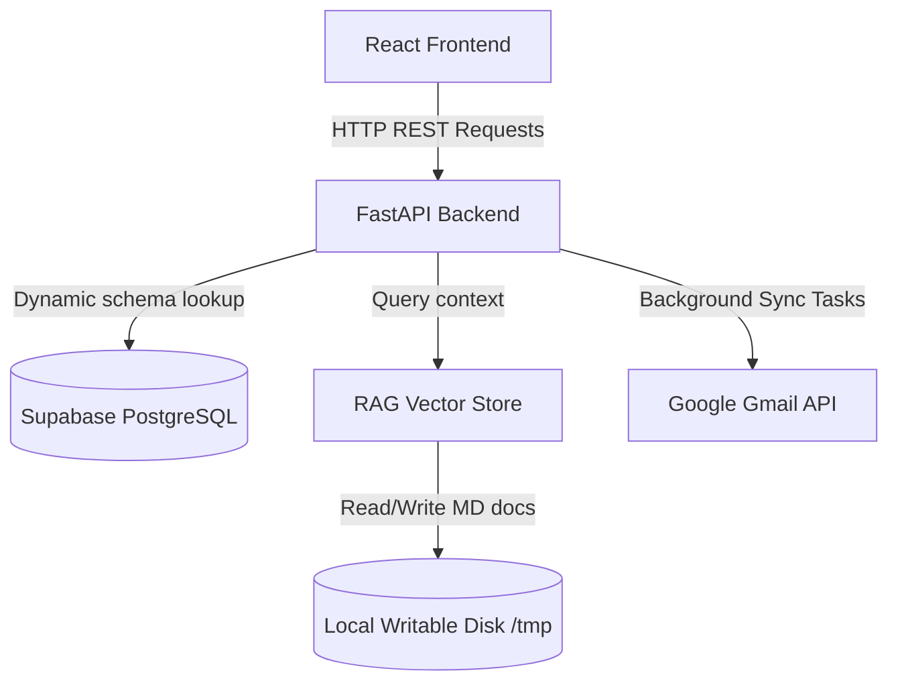

# Developer Handover & System Architecture Documentation

Welcome to the AI Sales Operations platform. This document outlines the architecture, database configurations, RAG pipeline, and custom integration flows to assist developers in onboarding, maintaining, and extending this project.

---

## 1. System Architecture Overview

The application is structured as a decoupled client-server architecture:
*   **Backend**: Python 3.14 / FastAPI web framework with SQLAlchemy 2.0 ORM, PostgreSQL database persistence (Supabase in production, SQLite in local sandbox), and an in-memory TF-IDF semantic search vector engine for Retrieval-Augmented Generation (RAG).
*   **Frontend**: React 18 / TypeScript / Vite Single Page Application styled with Vanilla Tailwind CSS, Framer Motion transitions, Lucide icons, and Recharts.



---

## 2. Multi-Tenant Database Architecture

To support isolated workspaces for different companies without data leaks, the platform uses **PostgreSQL Schema Separation Mode** driven by HTTP headers:

### A. Dynamic Tenant Routing
*   Every client request includes an `X-Session-ID` header (or `session_id` query parameter).
*   In `backend/app/models/database.py`, the `get_db` dependency intercepts this header, sanitizes it, and sets it as a context variable:
    ```python
    tenant_session_id.set(session_id)
    ```
*   For PostgreSQL connections, it executes an initialization statement setting the search path to that tenant's schema:
    ```sql
    SET search_path TO session_{session_id}
    ```
*   If the database schema or tables do not exist (first-time onboarding), the system auto-runs `Base.metadata.create_all()` inside that specific schema and commits the transaction immediately.

### B. Database Connection Pool Tuning
To support multi-tenancy without hitting pool exhaustion or database query timeouts, the engine creation parameters in `backend/app/models/database.py` are optimized:
```python
engine = create_engine(
    DATABASE_URL,
    pool_size=30,          # Holds up to 30 active sessions
    max_overflow=15,       # Allows overflow burst connections
    pool_pre_ping=True,    # Validates connections before checkout
    pool_recycle=1800      # Recycles stale connections every 30 mins
)
```

---

## 3. Dynamic RAG Ingestion Pipeline

The platform enables onboarding tenants to upload custom product catalogs, pricing volume tiers, and FAQs.

### A. File Storage & Paths
*   To bypass read-only serverless container filesystems in production (like Render), `RAGService` uses a writable root path pointing to `/tmp/knowledge` on Linux:
    ```python
    default_root = Path("/tmp/knowledge") if os.name != "nt" else Path(__file__).resolve().parent.parent.parent / "knowledge"
    ```
*   Each workspace uploads files to `knowledge_root / f"session_{session_id}"`.
*   During initial schema setup, default sales policies and markdown templates are copied from the static repository assets folder to `/tmp/knowledge/session_{session_id}` so the RAG agent has a base template immediately.

### B. Vector Indexing & Invalidation
*   The `RAGService` chunks document text and runs semantic text search.
*   When a document is uploaded or deleted, the in-memory cache is invalidated:
    ```python
    self.documents_by_session[sid] = []
    self.initialized_sessions[sid] = False
    ```
    This triggers a re-read and re-indexing of the session's active files on the next workflow execution.

---

## 4. Google OAuth & Background Synchronization

The agent checks the connected inbox for enquiries using a polling loop.

### A. Concurrent Polling Task
In `backend/app/main.py`, a background async polling manager runs in the background. It finds all active database session schemas and checks their Gmail inboxes concurrently:
```python
async def poll_tenant(tenant):
    token = tenant_session_id.set(tenant)
    try:
        await poll_gmail_inbox(db)
    finally:
        tenant_session_id.reset(token)

# Run polling loops concurrently to avoid thread blockages
await asyncio.gather(*(poll_tenant(t) for t in tenant_sessions), return_exceptions=True)
```
*   **Polling Interval**: Configured to run every **60 seconds**, maintaining connection economy.

### B. Credentials Defaults API
The `/workspace/credentials-defaults` endpoint dynamically extracts the base URL from incoming requests so that the OAuth callback points to the correct domain context (supporting both local sandbox ports and production proxy hosts).

---

## 5. Frontend Architecture & Custom Components

### A. Layout Middleware
The `DashboardLayout.tsx` parent layout acts as a gatekeeper. It queries `mockApi.getWorkspace()` on mount. If a workspace is not found or `onboarding_completed` is `false`, it forces redirection to `/onboarding`. This stops incomplete workspaces from running workflows with default settings.

### B. Notification Dots (Sidebar)
*   **Notifications**: Pulsating red dot (`bg-[#ff5f57]`) displays if any entry in the database remains unread.
*   **Approvals**: Pulsating orange dot (`bg-[#ff9f0a]`) displays on the Approvals link if any approval task is in a `'pending'` status state. Checks are executed every 10 seconds.

### C. Reusable Dialogs
The custom `Dialog.tsx` component is equipped with a `showCancel` parameter:
```typescript
interface DialogProps {
  isOpen: boolean;
  onClose: () => void;
  title: string;
  children: ReactNode;
  onConfirm?: () => void;
  confirmText?: string;
  showCancel?: boolean;
}
```
Setting `showCancel={false}` hides the secondary "Cancel" button, preventing duplicate control options in document viewer modals.

---

## 6. Recent Key Fixes & Design Rationale

When onboarding, debugging, or auditing changes, keep these updates in mind:

1.  **SQLite/PG Session Setup Transaction Commits**:
    *   *Issue*: Table schemas created dynamically for new tenant sessions were not committed to PostgreSQL when seeder bypasses occurred, raising `Relation workspaces does not exist` database errors on setup.
    *   *Fix*: Explicitly added `db.commit()` statements directly after table creation metadata updates in `get_db()`.
2.  **Render Writable Paths**:
    *   *Issue*: Production containers crashed on catalog upload due to filesystems being read-only.
    *   *Fix*: Redirected dynamic knowledge file write directories to `/tmp`.
3.  **Background Connection Fatigues**:
    *   *Issue*: Sequential polling threads locked SQLAlchemy connections pool, causing settings saves and OAuth checks to hang.
    *   *Fix*: Tuned connection pools and executed sync functions concurrently inside `asyncio.gather`.

---

## 7. How-To Developer Quickstart (Local Development)

To run the application locally on a workstation:

### A. Start Backend Server
1.  Navigate to the backend folder:
    ```bash
    cd backend
    ```
2.  Activate your virtual environment:
    ```bash
    source venv/bin/activate
    ```
3.  Run the application using Uvicorn:
    ```bash
    uvicorn app.main:app --host 0.0.0.0 --port 8000 --reload
    ```

### B. Start Frontend Dev Client
1.  Navigate to the frontend folder:
    ```bash
    cd ../frontend
    ```
2.  Install packages (if needed):
    ```bash
    npm install
    ```
3.  Boot the Vite client:
    ```bash
    npm run dev
    ```
4.  Open [http://localhost:5173](http://localhost:5173) in your browser.
