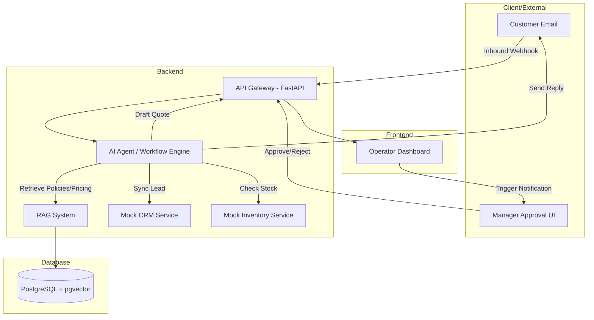

# System Architecture Specification

This document provides a high-level overview of the AI Sales Operations Manager architecture, outlining components, data flow, and technology choices optimized for our hackathon demo.

---

## 🏗️ High-Level Component Diagram

---

## 💻 Component Breakdown

### 1. Frontend: Operator Dashboard
*   A responsive dashboard to monitor ongoing agent runs.
*   Shows active, pending, approved, and completed workflows.
*   Contains a manual fallback interface where a human operator can review the AI's drafts (Quotations, Emails) and approve them.

### 2. Backend API Gateway
*   Exposes endpoints to receive inbound webhook simulations (e.g., simulating customer emails).
*   Handles communication between the Dashboard and the Agent/Workflow engine.
*   Maintains simple mock services for CRM and Inventory systems.

### 3. Workflow / Agent Engine
*   Coordinates the execution of the multi-step sales enquiry processing workflow.
*   Stateful execution to allow halting and resuming for manager approval.
*   Uses an LLM agent or structured workflow router (e.g., LangGraph or custom state machine) to execute each step reliably.

### 4. RAG & Knowledge Retrieval
*   Indexes company pricing sheets, FAQs, and discount rules.
*   Uses semantic search to extract relevant snippets when composing quotations.

---

## 🔄 Design Priorities (Hackathon Mode)
1.  **Reliability & Predictability**: The workflow path must be highly reliable. If LLM responses are variable, use structured JSON outputs and fallbacks.
2.  **State Management**: Must support pausing the workflow state when waiting for approval and resuming seamlessly.
3.  **Low Latency**: Ensure fast mock responses and quick visual feedback on the operator dashboard.
